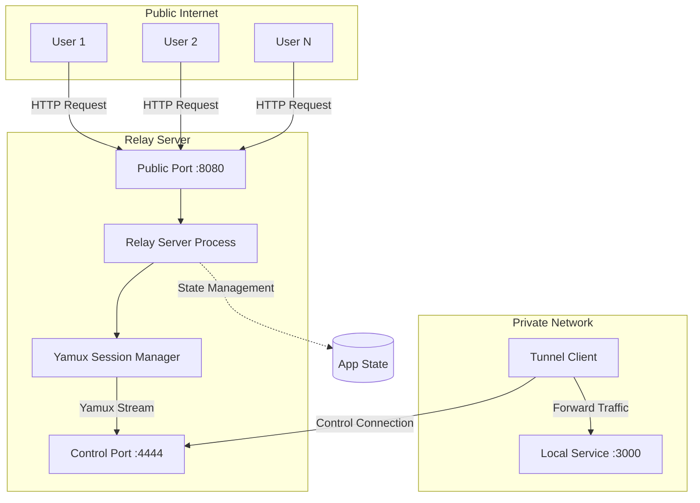

# Design Document: Reverse Tunnel Service

## Overview

The reverse tunnel service is implemented as a distributed system with two main components: a relay server and tunnel clients. The system uses the yamux multiplexing protocol to efficiently manage multiple concurrent connections over a single TCP connection between each client and the server.

The architecture follows an event-driven, asynchronous design using Rust's tokio runtime for high-performance I/O operations. The relay server acts as a bridge between public internet traffic and private local services, while tunnel clients establish persistent connections to forward traffic to their local services.

## Architecture



The system operates in three phases:
1. **Connection Establishment**: Tunnel client connects to relay server's control port
2. **Stream Multiplexing**: Public connections trigger new yamux streams to the client
3. **Traffic Bridging**: Bidirectional data forwarding between public users and local services

## Components and Interfaces

### Relay Server Component

**Responsibilities:**
- Accept and manage tunnel client connections on the control port
- Accept public traffic on the public ingress port
- Coordinate stream creation between public connections and tunnel clients
- Maintain application state for active client connections

**Key Interfaces:**
```rust
struct AppState {
    client_control: Option<Control>,
}

async fn handle_control_connection(socket: TcpStream, state: Arc<Mutex<AppState>>)
async fn handle_public_connection(socket: TcpStream, state: Arc<Mutex<AppState>>) -> Result<()>
```

**Configuration:**
- Control port (default: 4444) - for tunnel client connections
- Public port (default: 8080) - for incoming public traffic

### Tunnel Client Component

**Responsibilities:**
- Establish and maintain connection to relay server
- Accept incoming yamux streams from the server
- Forward stream traffic to configured local service
- Handle connection failures and cleanup

**Key Interfaces:**
```rust
async fn handle_server_stream(server_stream: StreamHandle, local_port: u16) -> Result<()>
```

**Configuration:**
- Server address (default: 127.0.0.1:4444) - relay server control port
- Local port (default: 3000) - target local service port

### Yamux Session Manager

**Responsibilities:**
- Multiplex multiple logical streams over single TCP connection
- Provide flow control and stream isolation
- Handle protocol-level errors and connection management

**Integration:**
- Server side: `Session::new_server()` with `session.control()` for stream creation
- Client side: `Session::new_client()` with stream acceptance via `session.next()`

### Stream Bridge Component

**Responsibilities:**
- Establish bidirectional data forwarding between connection pairs
- Handle connection cleanup when either side closes
- Provide error handling for I/O operations

**Implementation:**
```rust
let client_to_public = tokio::io::copy(&mut client_r, &mut public_w);
let public_to_client = tokio::io::copy(&mut public_r, &mut client_w);
future::try_join(client_to_public, public_to_client).await
```

## Data Models

### Connection State Model

```rust
struct AppState {
    client_control: Option<Control>,  // Active client connection control handle
}
```

The relay server maintains minimal state - only the control handle for the currently connected tunnel client. When a new client connects, it replaces any existing client connection.

### Configuration Models

```rust
// Server Configuration
struct ServerArgs {
    control_port: u16,    // Port for client connections
    public_port: u16,     // Port for public traffic
}

// Client Configuration  
struct ClientArgs {
    server_addr: String,  // Relay server address
    local_port: u16,      // Local service port
}
```

### Stream Lifecycle Model

1. **Stream Creation**: Public connection triggers `control.open_stream()` on relay server
2. **Stream Acceptance**: Tunnel client receives stream via `session.next()`
3. **Local Connection**: Client establishes connection to local service
4. **Bidirectional Bridge**: Data flows in both directions until either side closes
5. **Cleanup**: Both connections closed, resources freed

## Correctness Properties

*A property is a characteristic or behavior that should hold true across all valid executions of a system-essentially, a formal statement about what the system should do. Properties serve as the bridge between human-readable specifications and machine-verifiable correctness guarantees.*
### Core Properties

Property 1: Client connection management
*For any* sequence of tunnel client connections to the relay server, the server should establish yamux sessions for all connections but only use the most recent client for stream creation
**Validates: Requirements 1.3, 1.4**

Property 2: Public connection rejection without client
*For any* public connection attempt when no tunnel client is connected, the relay server should reject the connection with an appropriate error
**Validates: Requirements 1.5**

Property 3: Yamux session establishment
*For any* successful tunnel client connection, both client and server should establish compatible yamux sessions that can create and accept streams
**Validates: Requirements 2.2, 2.3**

Property 4: Connection failure handling
*For any* connection failure scenario (network, protocol, or service), the affected component should terminate gracefully with appropriate error reporting
**Validates: Requirements 2.4, 2.5**

Property 5: Stream creation and forwarding
*For any* public connection to the relay server with an active tunnel client, the server should create a yamux stream and the client should establish a connection to the local service
**Validates: Requirements 3.1, 3.2**

Property 6: Bidirectional data forwarding
*For any* established stream bridge between public connection and local service, data sent in either direction should be forwarded to the other side until either connection closes
**Validates: Requirements 3.3**

Property 7: Connection cleanup
*For any* stream where either the public connection or local service connection closes, both connections should be closed gracefully
**Validates: Requirements 3.4**

Property 8: Local service unavailability handling
*For any* stream request when the local service is unavailable, the tunnel client should close the stream and log an error without affecting other streams
**Validates: Requirements 3.5**

Property 9: Concurrent stream multiplexing
*For any* number of simultaneous public connections, the relay server should create separate yamux streams that are multiplexed over the single control connection, with each stream handled independently by the client
**Validates: Requirements 4.1, 4.2, 4.3**

Property 10: Stream error isolation
*For any* stream that encounters an error, other active streams in the same yamux session should continue operating normally
**Validates: Requirements 4.4**

Property 11: Session failure cascade
*For any* yamux session failure, all active streams in that session should be closed and the connection should be terminated
**Validates: Requirements 4.5**

Property 12: Configuration argument parsing
*For any* valid command-line arguments provided to either server or client, the system should parse and apply the configuration correctly
**Validates: Requirements 5.1, 5.2**

Property 13: Invalid argument handling
*For any* invalid command-line arguments, the system should display usage information and exit with an error code
**Validates: Requirements 5.4**

Property 14: Event logging
*For any* significant system event (connections, errors, transfers), the system should generate appropriate log messages with timestamps and context
**Validates: Requirements 6.1, 6.2, 6.3, 6.5**

Property 15: Error resilience
*For any* recoverable error (stream failures, local service issues, I/O errors), the system should handle the error locally without affecting unrelated operations
**Validates: Requirements 7.1, 7.2, 7.3, 7.5**

Property 16: Connection loss recovery
*For any* control connection loss, the relay server should clear its client reference and be ready to accept new client connections
**Validates: Requirements 7.4**

Property 17: Resource cleanup
*For any* completed or failed operation, all associated resources (connections, tasks, streams, sessions) should be properly cleaned up
**Validates: Requirements 8.1, 8.2, 8.3, 8.4, 8.5**

## Error Handling

The system implements comprehensive error handling at multiple levels:

### Connection Level Errors
- **Control Connection Failures**: Server clears client state and continues accepting new clients
- **Public Connection Failures**: Individual connection errors don't affect server operation
- **Local Service Unavailability**: Client closes affected stream but continues processing others

### Protocol Level Errors
- **Yamux Protocol Errors**: Logged with context, session terminated if unrecoverable
- **Stream Errors**: Isolated to individual streams, other streams continue normally
- **I/O Errors**: Both ends of affected connections closed cleanly

### Application Level Errors
- **Configuration Errors**: Display usage and exit with error code
- **Resource Exhaustion**: Graceful degradation where possible, proper cleanup on failure
- **Shutdown Signals**: Graceful closure of all active connections and resources

### Error Recovery Strategies
- **Stateless Design**: Server maintains minimal state, easy to recover from client disconnections
- **Task Isolation**: Each stream handled in separate async task, failures don't cascade
- **Resource Cleanup**: Automatic cleanup via Rust's RAII and async task completion

## Testing Strategy

The testing approach combines unit tests for specific scenarios with property-based tests for comprehensive coverage of the system's behavior across all possible inputs.

### Unit Testing Focus
- **Configuration parsing**: Test specific argument combinations and edge cases
- **Error conditions**: Test specific failure scenarios and error messages
- **Integration points**: Test component interactions with known inputs
- **Protocol compliance**: Test yamux session setup and stream handling

### Property-Based Testing Focus
- **Connection management**: Test all possible sequences of client connections and disconnections
- **Stream multiplexing**: Test concurrent stream creation and data forwarding across varying loads
- **Error resilience**: Test system behavior under various failure conditions
- **Resource management**: Test that resources are properly cleaned up across all execution paths

### Testing Configuration
- **Framework**: Use `proptest` for property-based testing in Rust
- **Iterations**: Minimum 100 iterations per property test to ensure comprehensive coverage
- **Test Environment**: Use localhost connections and mock services for isolated testing
- **Concurrency Testing**: Use tokio-test for async testing and race condition detection

### Property Test Implementation
Each correctness property will be implemented as a property-based test with the following structure:
- **Test Tag**: `Feature: reverse-tunnel-service, Property N: [property description]`
- **Input Generation**: Smart generators that create realistic network scenarios
- **Assertion**: Verify the property holds across all generated inputs
- **Cleanup**: Ensure test resources are properly cleaned up after each iteration

The dual testing approach ensures both correctness (properties hold universally) and reliability (specific edge cases are handled correctly).